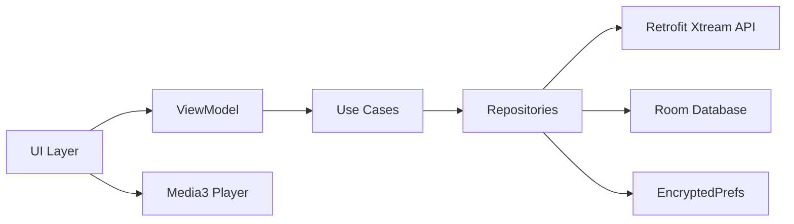

**BAYYARI Player — Test & Analysis Summary**

This repository contains the BAYYARI Player Android app and artifacts produced during a security assessment (static and dynamic testing).

Summary of actions performed
- Booted Pixel_8_API_34 emulator and installed the debug APK.
- Completed Module-1: static APK analysis; report saved to `artifacts/module1/module1_report.md`.
- Attempted Module-2: dynamic testing using mitmproxy to capture HTTP(S) traffic. Initial TLS interception failed because the emulator did not trust the proxy CA.
- Deployed Frida to the emulator and injected a bypass script to neutralize certificate pinning. Frida injection succeeded.

Key artifacts
- Module-1 report: `artifacts/module1/module1_report.md`
- MITM logs & captures: `artifacts/module2/mitmdump_console.log`, `artifacts/module2/flows.mitm` (if present)
- CA install attempts and trust dumps: `artifacts/module2/dumpsys_trust*.txt`, `artifacts/module2/download_list_after.txt`
- Frida files: `artifacts/module2/frida_bypass.js`, `artifacts/module2/frida_launch.txt`
- Screenshots / UI dumps: `artifacts/module2/screen_p12_after.png`, `artifacts/module2/window_dump_after.xml`

How to reproduce HTTPS capture (using existing setup)
1. Start mitmdump on the host (example):

   "C:\\Users\\...\\mitmdump.exe" --confdir "E:/mitmconf" -p 8080 -w "E:/mitmflows/flows.mitm"

2. Ensure emulator proxy points to host (example): `settings get global http_proxy` -> `10.0.2.2:8080`.
3. Start the app under Frida (the assessment already pushed `frida-server` and created `artifacts/module2/frida_bypass.js`). Run the Frida spawn command to inject the bypass script if not running.
4. Trigger app network actions (login, fetch channels, EPG, etc.). mitmdump should record decrypted HTTPS flows while Frida is active.

Notes & next steps
- If mitmproxy TLS failures persist, either install the mitmproxy CA as a system CA on a rooted/unlocked emulator or keep using Frida to bypass pinning.
- If you want, I can run the capture now and save flows to `artifacts/module2/flows.mitm`.

Contact / evidence
- All automated commands, logs and screenshots created during the assessment are stored under `artifacts/module2/` and `artifacts/module1/`.
# BAYYARI-TV IPTV Player

BAYYARI-TV is a Kotlin-based IPTV player for Android phones/tablets and Android TV devices. It supports Xtream Codes and M3U playlists, a dark-first UI, and a Leanback-optimized TV experience.

## Requirements
- Android Studio Giraffe or newer
- JDK 17
- Android SDK 34

## First-time build setup

This repo ships the Gradle wrapper scripts (`gradlew`, `gradlew.bat`) and `gradle/wrapper/gradle-wrapper.properties` (Gradle 8.4), but **not** the binary `gradle/wrapper/gradle-wrapper.jar` — it must be present before the wrapper scripts will run. Pick one of:

1. **Recommended:** open the project in Android Studio. On first Gradle sync the IDE downloads and installs `gradle-wrapper.jar` for you, using the URL in `gradle-wrapper.properties`.
2. **If you have a system Gradle install:** run once from the project root —
   ```
   gradle wrapper --gradle-version 8.4 --distribution-type bin
   ```
3. **Manual fallback:** download `gradle-wrapper.jar` from
   `https://raw.githubusercontent.com/gradle/gradle/v8.4.0/gradle/wrapper/gradle-wrapper.jar`
   and place it at `gradle/wrapper/gradle-wrapper.jar`.

After the wrapper jar is in place:

- **Windows:** `gradlew.bat assembleDebug`
- **macOS / Linux:** `chmod +x gradlew && ./gradlew assembleDebug`

## Build & Run
1. Open the project in Android Studio.
2. Let Gradle sync.
3. Run `app` on a device or emulator (phone or TV).

## Launcher icon

The launcher icons in `res/mipmap-*` and the TV banner at `res/drawable-xhdpi/banner_tv.png` were generated from `bayyari logo.ico`. The largest frame in that ICO is only **32×32 px**, so the icons at higher densities (`xxhdpi`, `xxxhdpi`) are slightly soft. Before publishing to the Play Store / Amazon Appstore, regenerate the assets from a higher-resolution source (PNG ≥ 512×512) using Android Studio's *Image Asset* wizard. The generation PowerShell script lives in your shell history (search for `Add-Type -AssemblyName System.Drawing`) if you want to rerun it against a new master.

## Architecture
- **MVVM + Clean Architecture**
- **Repository pattern** for data access
- **Room** for local cache
- **Media3** for playback



## Features
- Xtream Codes login and M3U playlists
- Live TV, VOD, and Series playback
- Catch-up (timeshift) playback
- EPG guide overlay
- Favorites and watch history
- Periodic background refresh
- Leanback TV UI

## Notes
- Offline download for movies is a stretch goal and not included in v1.
- For best results, ensure your IPTV server supports HLS.

## Tests
Run unit tests with:

```bash
./gradlew test
```
