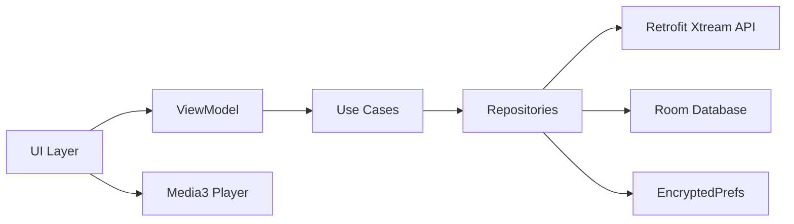

# BAYYARI-TV IPTV Player

BAYYARI-TV is a Kotlin-based IPTV player for Android phones/tablets and Android TV. It supports Xtream Codes and M3U playlists, provides a leanback-optimized TV experience, and uses Media3 for playback.

## Requirements
- Android Studio Giraffe or newer
- JDK 17
- Android SDK 34

## Build & Run
- Debug APK: `./gradlew :app:assembleDebug`
- Unit tests: `./gradlew test`

## Project Structure (Overview)

### Root
- [build.gradle.kts](build.gradle.kts): Top-level Gradle configuration.
- [settings.gradle.kts](settings.gradle.kts): Gradle project/module registration.
- [gradle.properties](gradle.properties): Gradle and Android build settings.
- [_assets_generated/](./_assets_generated/): Generated assets used by the app and build tools.
- [app/](app/): Main Android application module.

### App module
- [app/build.gradle.kts](app/build.gradle.kts): App module build configuration, dependencies, and Android settings.
- [app/proguard-rules.pro](app/proguard-rules.pro): Proguard/R8 rules for release builds.
- [app/src/main/AndroidManifest.xml](app/src/main/AndroidManifest.xml): App manifest, activities, and permissions.

### Kotlin source structure
- [app/src/main/java/com/bayyari/tv/](app/src/main/java/com/bayyari/tv/): App entry point and top-level packages.
- [app/src/main/java/com/bayyari/tv/BayyariTvApp.kt](app/src/main/java/com/bayyari/tv/BayyariTvApp.kt): Application class and app-wide initialization.

#### Data layer
- [app/src/main/java/com/bayyari/tv/data/api/](app/src/main/java/com/bayyari/tv/data/api/): Retrofit API and network interceptors.
- [app/src/main/java/com/bayyari/tv/data/api/DynamicHostInterceptor.kt](app/src/main/java/com/bayyari/tv/data/api/DynamicHostInterceptor.kt): Dynamically updates API base host based on user settings.
- [app/src/main/java/com/bayyari/tv/data/api/XtreamApiService.kt](app/src/main/java/com/bayyari/tv/data/api/XtreamApiService.kt): Xtream Codes API interface.
- [app/src/main/java/com/bayyari/tv/data/api/models/](app/src/main/java/com/bayyari/tv/data/api/models/): Network DTOs for live, movie, series, and EPG data.
- [app/src/main/java/com/bayyari/tv/data/local/dao/](app/src/main/java/com/bayyari/tv/data/local/dao/): Room DAOs for cached content.
- [app/src/main/java/com/bayyari/tv/data/local/entities/](app/src/main/java/com/bayyari/tv/data/local/entities/): Room entities for channels, movies, series, watch history, and favorites.

#### Domain layer
- [app/src/main/java/com/bayyari/tv/domain/model/](app/src/main/java/com/bayyari/tv/domain/model/): Domain models such as channel and server.

#### Dependency injection
- [app/src/main/java/com/bayyari/tv/di/NetworkModule.kt](app/src/main/java/com/bayyari/tv/di/NetworkModule.kt): Hilt module wiring for API clients and networking.

#### Utilities
- [app/src/main/java/com/bayyari/tv/util/Constants.kt](app/src/main/java/com/bayyari/tv/util/Constants.kt): Shared constants (API, update URLs, cache keys).
- [app/src/main/java/com/bayyari/tv/util/EncryptedPrefs.kt](app/src/main/java/com/bayyari/tv/util/EncryptedPrefs.kt): Secure preferences storage.
- [app/src/main/java/com/bayyari/tv/util/Extensions.kt](app/src/main/java/com/bayyari/tv/util/Extensions.kt): App-wide Kotlin extensions.
- [app/src/main/java/com/bayyari/tv/util/M3uParser.kt](app/src/main/java/com/bayyari/tv/util/M3uParser.kt): M3U playlist parsing.
- [app/src/main/java/com/bayyari/tv/util/NetworkUtils.kt](app/src/main/java/com/bayyari/tv/util/NetworkUtils.kt): Network and connectivity helpers.
- [app/src/main/java/com/bayyari/tv/util/StreamUrlBuilder.kt](app/src/main/java/com/bayyari/tv/util/StreamUrlBuilder.kt): Builds stream URLs for live, VOD, and series.

#### Update system
- [app/src/main/java/com/bayyari/tv/update/UpdateManager.kt](app/src/main/java/com/bayyari/tv/update/UpdateManager.kt): Checks update.json, downloads APKs, verifies signatures, and launches the installer.
- [app/src/main/java/com/bayyari/tv/ui/settings/SettingsFragment.kt](app/src/main/java/com/bayyari/tv/ui/settings/SettingsFragment.kt): Settings UI and update flow status messaging.

### Resources
- [app/src/main/res/](app/src/main/res/): All app resources (layouts, drawables, strings, and configuration).
- [app/src/main/res/values/strings.xml](app/src/main/res/values/strings.xml): App strings, including update status messaging.
- [app/src/main/res/values/themes.xml](app/src/main/res/values/themes.xml): Theme definitions for phone and TV.
- [app/src/main/res/xml/preferences_settings.xml](app/src/main/res/xml/preferences_settings.xml): Settings preference screen definitions.
- [app/src/main/res/xml/network_security_config.xml](app/src/main/res/xml/network_security_config.xml): Network security configuration.

### Build outputs
- [build/reports/problems/problems-report.html](build/reports/problems/problems-report.html): Gradle problems report (generated by builds).

## Architecture
- MVVM + Clean Architecture
- Repository pattern for data access
- Room for local cache
- Media3 for playback

## Features
- Xtream Codes login and M3U playlists
- Live TV, VOD, and Series playback
- Catch-up (timeshift) playback
- EPG guide overlay
- Favorites and watch history
- Periodic background refresh
- Leanback TV UI

## Notes
- Offline download for movies is not included in v1.
- For best results, ensure your IPTV server supports HLS.
